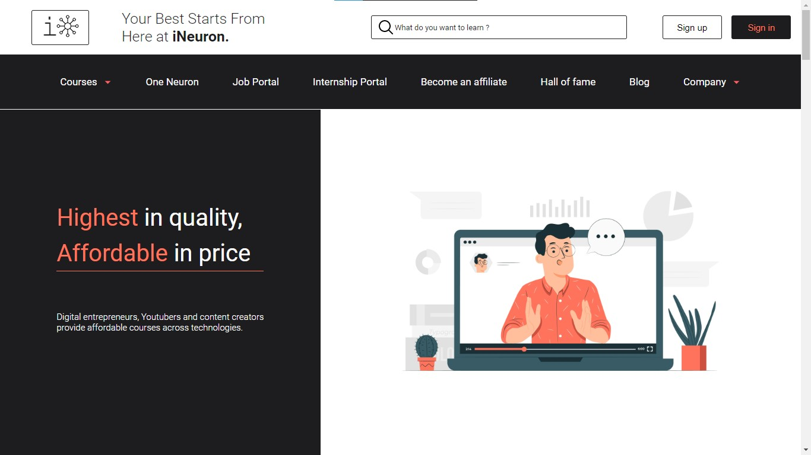

# iNeuron Website redesign :

Hi Guys, My name is **Danesh Tolani** and I have created a home page for **iNeuron.ai** website. Please visit the link provided below for the deployed website.

---

## Design

For the design of this webpage, I wanted to go with a simple, flat yet an eye catching look. So, I used **Orange** as an accent color that I gave at some places.

I wanted to follow a theme that is consistent throughout the webpage. You can see in the webpage that the white and black box combination is repeated after the Hall of fame section.

Black box is setup like: left - right - left then cards then again left - right - left and cards.

## Development

For development of this webpage I have used just **HTML & CSS** and no JavaScript or any other frame works. I have majorly used **Flex-Box** for aligning the contents.

For the illustrations and icons I have used following resources:

- ### [freepick](https://www.freepik.com/)

- ### [iNeuron](https://ineuron.ai/)

- ### [icons8](https://icons8.com/)

---

## Click on the below link to checkout the deployed website

